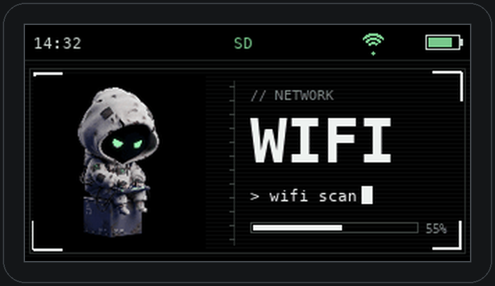
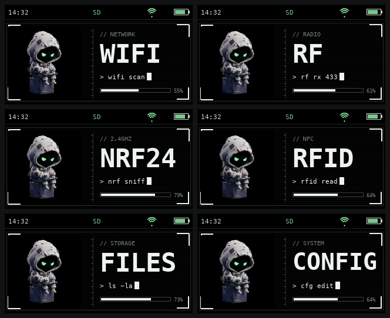
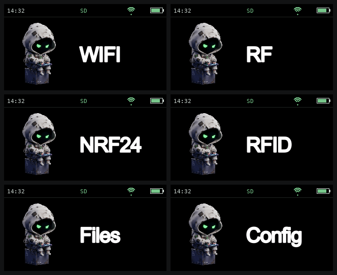

# 🕶️ Bruce Hacker Theme

  

> **EN** — A hacker-themed UI for the **[Bruce firmware](https://github.com/BruceDevices/firmware)** on the LilyGO T-Embed CC1101 (320×170). A hooded, green-eyed hacker shows up on every menu entry, with the menu label to its right. Two variants: **v2** (clean) and **v3** (technical HUD). Copy a theme folder to the SD card, then pick it in `Config → UI Theme`.

Thème UI pour le firmware **[Bruce](https://github.com/BruceDevices/firmware)**, pensé pour le
**LilyGO T-Embed CC1101** (écran 320×170). Un petit hacker encapuchonné aux yeux
verts s'affiche sur **chaque entrée du menu**, avec le nom du menu à sa droite.

Deux variantes sont incluses :

| Variante | Style | Aperçu |
|----------|-------|--------|
| **Hacker v2** | Perso à gauche, libellé simple à droite | [voir](docs/hacker-v2.png) |
| **Hacker v3** | Interface « HUD technique » : cadre, catégorie, ligne terminal, barre de progression | [voir](docs/hacker-v3.png) |

### Hacker v3 — HUD technique

### Hacker v2 — épuré

## 📦 Contenu

- `Hacker v2/` — 16 GIF (320×140) + `Hacker v2.json`
- `Hacker v3/` — 16 GIF (320×140) + `Hacker v3.json`

Chaque thème couvre les **16 entrées** du menu Bruce : WiFi, BLE, RF, RFID, FM, IR,
Files, GPS, NRF24, Interpreter, Others, Clock, Connect, Config, Ethernet, LoRa.

## 🚀 Installation

### Via carte SD
1. Copie le dossier `Hacker v3` (ou `Hacker v2`) à la racine de la carte SD.
2. Sur l'appareil : **Config → UI Theme → SD Card → `Hacker v3/Hacker v3.json`**.

### Via WebUI (WiFi, sans carte à retirer)
1. Sur l'appareil : **Files → WebUI**.
2. Connecte-toi au WiFi affiché, ouvre l'IP dans le navigateur.
3. Upload le dossier du thème dans la SD ou le LittleFS, puis sélectionne le `.json`
   dans **Config → UI Theme**.

## 🎨 Notes techniques

- Le nom du menu est **intégré dans l'image** et `label` est à `0` : c'est ce qui
  permet d'avoir le texte **à droite** du personnage (le firmware, lui, dessine
  toujours le libellé centré *sous* l'icône).
- Le haut de l'écran (heure, SD, WiFi, batterie) est **laissé libre** : ce sont les
  icônes de statut dessinées par le firmware, on n'y met rien.
- GIF statiques (1 frame), ~7–9 KB pièce → légers pour l'ESP32.
- Couleurs (`priColor` / `secColor` / `bgColor`) au format RGB565 dans le `.json`.

## 🖥️ Compatibilité

Conçu pour le **LilyGO T-Embed CC1101** (320×170). Devrait fonctionner sur les
autres cibles Bruce de résolution proche ; sur des écrans plus petits/grands,
les images peuvent être recadrées.

## ☕ Un café ?

Si ce thème te plaît, tu peux me payer un café :

## 📄 Licence

MIT — voir [LICENSE](LICENSE). Thème par **koua29** (Arnaud).
